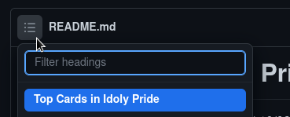

# Top Cards in Idoly Pride

*Opinion of @tokanada#4423 | Updated 10/08/2022*

Tip Use the table of contents feature!

---

## A brief explanation

I wanted to make this tier list, firstly, to help other players decide on which cards to spent their hard-earned diamonds on. However, I also wanted to see which cards are most commonly used and which cards have been left behind in the meta. This tier list is **judged by my own personal experience** playing the game and seeing which **cards I see the most in both PvP and Regular High Score Lives.** Specialized and niche cards are positioned lower on this tier list while **cards that see action in both, PvP and High Score, are scored higher.** Parts of this list has also been influenced by the current/previous VENUS Race Event. Please keep this in mind.

Also, a sidenote. I left out most of the 2, 3, and 4 star cards because I do not know about the viability of most them. However, the ones I have listed to see occasional use.

### Tier List Tiers

I've decided to divide this tier list into the following tiers.

1. SS Tier - These cards are the most commonly used and see consistent success

2. S Tier - These cards are consistently used, but may or may not have substitutes

3. A Tier - These cards offer near the same viability as the S tier, but see less success

4. B Tier - These cards are often used in niche teams and may require specific team building to fully utilize them

5. C Tier - These cards are rarely used but may show up occasionally in teams

6. D Tier - I literally never see these cards in use

7. ?? Tier - These cards are either too new or I simply don't know enough about them. This could be due to their nicheness or even their inviability in the meta.

And so, without further ado.

# IDOLY PRIDE - CARD TIER LIST

-----

## SS Tier - Must Have

* Dance Mana
- Fes Kotono

- Fes Mei

- Fes Rio

- Fes Sakura

- Fes Yu
* Initial Miho
- Initial Sakura
- Sun Sakura

----

## S Tier - QoL Improving

* Bride Kotono

* Bear Suzu

* Binary Saki

* Christmas Rui

* Flower Nagisa

* Initial Aoi

* Initial Fran

* Initial Kana

* Initial Mei
- Initial Shizuku
* KokoroDistance Rei

* Sniper Ai

* Sister Kokoro

* Swimsuit Kokoro

---

## A Tier - Nice to Haves

* China Shizuku

* Dance Buffer Suzu

* Devil Nagisa

* Fes Sumire

* Fireworks Sakura (2 star)

* Initial Ai
- Initial Chisa

- Initial Haruko

- Initial Mana

- Initial Nagisa

- Initial Rui

- Initial Suzu

- Initial Yu

- Miku Event Yu
* New Year's Saki

* New Year's Sakura
- Sun Haruko

- Swimsuit Nagisa 1

- Swimsuit Rui
* Valentine Ai

* Yukata Yu

---

## B Tier - Viable but Niche

- 4 Star Haruko

- 4 Star Rei

- Binary Chisa

- China Haruko

- Cherry Sumire
* Dance Event Rio

* Dress Suzu

* Fashion Rui
- Fireworks Mana
* Hatsune Miku

* Initial Kotono
- Initial Rei
* Initial Rio

* KokoroDistance Mei

* Rock Shizuku

* Rock Chisa

* Swimsuit Aoi
- Swimsuit Suzu
- Zombie Rio

---

## C Tier - Powercrept but Niche

* Initial Kokoro

* Initial Saki

* New Year's Rei

* Swimsuit Kotono

* Swimsuit Sumire

* Swimsuit Yu

---

## D Tier - Powercrept & Unused

* CherryBlossum Rei

* Initial Sumire

* Swimsuit Haruko

---

## ?? Tier - Too new or never seen in action

- Cat Aoi

- Cat Ai

- Crocus Shizuku

- Christmas Haruko

- Christmas Sumire

- Christmas Yu
* Hoshiumi Kotono

* Hoshiumi Scorer Kotono

* Hoshiumi Rio

* Hatsune Rui

* Monocule Rio

* Opera Saki

* Sister Chisa

* Swimsuit Ai

* Swimsuit Mei 1 & 2

* Swimsuit Nagisa 2

* Swimsuit Rei
- Swimsuit Saki

- Swimsuit Yu
* Valentine Aoi

* Valentine Kokoro

----

*-but like, that's just your opinion man*

## Feel free to suggest changes to this tier list via Pull Request or Issues
